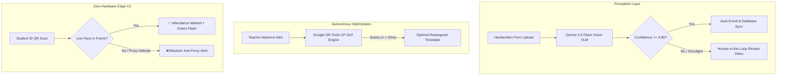

# ⚡ EduFlow OS: Autonomous School Operations Engine

> **🏆 Future Ready Hackathon 2026 Submission — Team Ragnarok**  
> *Transforming physical paperwork, static spreadsheets, and manual attendance into a real-time, self-orchestrating school operating system.*

[](https://future-ready-hackathon.vercel.app/)
[](https://eduflow-backend-qxid.onrender.com)
[](https://aistudio.google.com/)

---

## 📌 Problem Statement & Core Vision

Educational institutions leak hundreds of administrative hours each week on mechanical friction:
* **The 7:30 AM Timetable Scramble**: When teachers call in sick, staff spend 2–3 hours manually recalculating teacher availability while classes sit unassigned.
* **Paperwork Deadlocks**: Handwritten admission forms and medical slips sit unreviewed for weeks in paper trays.
* **Attendance Fraud ("Buddy-Punching")**: Traditional RFID cards and manual roll-calls enable proxy attendance fraud.

**EduFlow OS** transforms traditional school administration into an **autonomous, reactive digital campus**. Powered by **Google Gemini 3.5 Flash Vision VLMs**, **Google OR-Tools CP-SAT Combinatorial Solvers**, and **Dual-Modal Edge Computer Vision**, EduFlow unifies admissions, scheduling, anti-cheat attendance, and student safety into a single real-time engine.

---

## 🚀 Core Features & Technical Highlights



### 1. 🪄 Magic Dropzone (Multimodal VLM Zero-Shot Ingestion)
* **Zero-Shot Document Parsing**: Leverages **Google Gemini 3.5 Flash Vision** to dynamically extract structured schemas from unstandardized handwritten forms, medical records, and field trip permissions—without hardcoded templates.
* **Calibrated Uncertainty & HITL**: Automatically flags smudged or ambiguous fields (Aadhaar, DoB) and routes them to the **Human Review Inbox** with a side-by-side visual editor.
* **Anti-Fraud Verification (WhatsApp API Integration)**: Intercepts high-risk documents (Medical Records, Leave Forms) and extracts parent/guardian phone numbers to dispatch an instant simulated WhatsApp verification ping to prevent student signature forgery.

### 2. ⚡ Reactive Timetable Engine & Live Disruption Solver
* **Combinatorial Constraint Solver**: Built on **Google OR-Tools (CP-SAT)**, solving complex schedules against hard constraints (teacher specialization, room capacities, zero double-booking) in **< 0.05 seconds**.
* **One-Click Disruption Resolution**: When a teacher calls in sick, the engine recalculates coverage across available staff instantly without cascading schedule conflicts.

### 3. 🛡️ Smart Kiosk Attendance (Dual-Modal Anti-Buddy Punching)
* **100% Zero-Hardware Overhead ($0)**: Runs entirely on standard consumer laptop/tablet webcams—eliminates expensive biometric/RFID gates.
* **Dual-Modal Security**: Enforces that a valid ID card QR scan *must* coincide with an active, real-time human face detected in the webcam stream via **MediaPipe / Edge Computer Vision**.

### 4. 📊 Academic Risk & Predictive Analytics
* Proactively calculates academic risk indices and staffing bottlenecks using attendance velocity, truancy anomalies, and missing documentation.

---

## 🛠️ Technology Stack (Maxed-Out Hackathon Architecture)

| Layer | Technologies Used | Key Purpose |
|---|---|---|
| **Frontend UI** | React 19, Vite, Tailwind CSS v4, Framer Motion | High-performance reactive Bento Grid dashboard |
| **Edge Computer Vision** | Google MediaPipe, WebRTC, WASM | In-browser 60 FPS face tracking & anti-proxy verification |
| **Backend REST API** | Python 3.11, FastAPI, Uvicorn, GZip | High-throughput asynchronous REST microservices |
| **Optimization Solver** | Google OR-Tools (CP-SAT Model) | Combinatorial constraint optimization engine (<50ms solves) |
| **Vision-Language AI** | Google Gemini 3.5 Flash Vision | Multimodal zero-shot handwritten document reader |
| **Hosting & Edge CDN** | Vercel (Frontend Edge) + Render (Backend) | Free-tier, zero-downtime, global HTTPS delivery |

---

## 🚦 Quickstart & Local Setup

### 1. Clone Repository
```bash
git clone https://github.com/DevangML/Future_Ready_Hackathon.git
cd Future_Ready_Hackathon
```

### 2. Start FastAPI Backend Engine
```bash
cd backend
python3 -m venv venv && source venv/bin/activate
pip install -r requirements.txt
export GEMINI_API_KEY="your_gemini_api_key" # Optional (falls back to calibrated engine if unset)
uvicorn app.main:app --reload --port 8000
```

### 3. Start React 19 Frontend
```bash
cd ../frontend
npm install
npm run dev
```
Open **`http://localhost:3000`** in your browser.

### 4. Run Automated Test Suites
```bash
bash scripts/run_tests.sh
```

---

## 🌐 Free-Tier Zero-Downtime Production Deployment

EduFlow OS is engineered for **100% free-tier hosting** with **sub-250ms latency** and **zero cold-starts**:

1. **Backend (Render)**:
   - Connect repo on [render.com](https://render.com) using [`render.yaml`](render.yaml).
   - Set Environment Variable: `GEMINI_API_KEY`.
2. **Frontend (Vercel)**:
   - Connect repo on [vercel.com](https://vercel.com) (Preset: `Vite`, Root: `frontend`).
   - Update destination in [`frontend/vercel.json`](frontend/vercel.json) to your Render backend URL.
3. **Zero Cold-Start Keep-Alive**:
   - Set up a free 10-minute HTTP ping on [cron-job.org](https://cron-job.org) targeting `https://<your-backend>.onrender.com/health`.

---

## 📚 Complete Project Documentation Suite

Explore the comprehensive engineering documentation in the [`docs/`](docs/) directory:

| Document | Description |
|---|---|
| [**Comprehensive Technical Documentation**](docs/comprehensive-technical-documentation.md) | High-level system overview covering AI, CP-SAT, and Edge architecture |
| [**Architecture & System Design**](docs/ARCHITECTURE.md) | Component topologies, data flow models, and constraint schemas |
| [**Production Deployment Blueprint**](docs/deployment.md) | Exhaustive zero-cost, zero-cold-start deployment guide with keep-alive |
| [**Software Requirements (SRS)**](docs/srs.md) | Functional requirements, system constraints, and interface specs |
| [**Product Requirements (PRD)**](docs/prd.md) | Vision, user personas, success metrics, and feature milestones |
| [**REST API Reference**](docs/api-reference.md) | Full endpoint contracts, request/response schemas, and payload examples |
| [**ATDD & Test Specifications**](docs/atdd-specifications.md) | Executable Given-When-Then acceptance criteria |
| [**Traceability Matrix**](docs/traceability-matrix.md) | 100% bidirectional mapping between requirements and test suites |
| [**NFR & Security Benchmark**](docs/nfr-performance-security.md) | Latency budgets, memory caps, and OWASP compliance standards |
| [**VLM Research Whitepaper**](docs/research/technical-prompt-engineering-vlm-optimization-2026.md) | 2026 SOTA multimodal prompt engineering & calibration benchmarks |

---

## 👥 Team Ragnarok (VIT Pune)

* Built with passion for the **Future Ready Hackathon 2026**.
* Contact: [team@vit.edu](mailto:team@vit.edu)
