# 🏗️ EduFlow OS Architecture Spec & Data Flow

## System Overview

EduFlow OS is designed as a **Hybrid Edge-Cloud Autonomous Campus Engine**. It separates perception (unstructured data extraction), decision-making (mathematical constraint optimization), and execution into decoupled reactive modules.

```mermaid
graph TD
    subgraph Perception Layer
        A[Physical Form / Image Upload] -->|Image Bytes| B[Magic Dropzone Engine]
        B -->|Gemini 1.5 Vision VLM| C{Confidence Score > 80%?}
        C -->|Yes| D[Live Campus Memory DB]
        C -->|No / Smudged| E[Human Review Inbox]
    end

    subgraph Optimization Layer
        F[Teacher Absence Event] -->|Disruption Trigger| G[Google OR-Tools CP-SAT Solver]
        G -->|Constraint Re-Satisfaction| H[Conflict-Free Reassignment]
        H -->|State Stream| I[Dashboard Overview & Timetable Grid]
    end

    subgraph Edge CV Security Layer
        J[Webcam Stream] -->|60 FPS Landmarks| K[Edge Face Tracker]
        L[Student ID Card QR] -->|Token Scan| M{Dual Coincidence Check}
        K --> M
        M -->|Face + QR Present| N[Mark Attendance & Trigger Confetti]
        M -->|ID Card Only| O[Block Scan & Flag Anti-Cheat Alert]
    end
```

---

## Technical Specifications

### 1. Magic Dropzone (Vision-Language Model Ingestion)
- **Model**: Google Gemini 1.5 Pro VLM
- **Mode**: Zero-shot un-templated extraction
- **Output Schema**: Structured Pydantic / JSON containing student name, Aadhaar/ID, guardian contact, class applying for, and confidence metrics.
- **Safety Fallback**: Low-confidence or ambiguous handwriting is routed to `UNREVIEWED_DOCUMENTS` for 1-click administrator verification.

### 2. Reactive Timetable Engine (OR-Tools CP-SAT)
- **Engine**: Google OR-Tools CP-SAT (Constraint Programming - Satisfiability)
- **Hard Constraints**:
  1. Teacher Specialization: Substitute must match missing subject qualification (e.g. Mathematics, Chemistry).
  2. Zero Double-Booking: No teacher can be assigned to two classes during the same period.
  3. Room Capacity: Class size cannot exceed assigned laboratory/theory room limit.
- **Performance**: Solves full schedule reallocation in **< 50 milliseconds**.

### 3. Smart Kiosk Anti-Cheat Attendance
- **Engine**: `tracking.js` Haar Cascade Face Tracker + WebCam Stream API
- **Execution**: 100% Client-Side Edge Execution at 60 FPS
- **Security Logic**: Dual Coincidence (`Face Bounding Box Detected == True` AND `QR Token Valid == True`). Prevents proxy attendance / card swapping.
