# 🏗️ EduFlow OS Architecture Spec & Systems Engineering

## 1. System Overview
EduFlow OS is designed as a **Hybrid Edge-Cloud Autonomous Campus Engine**. It cleanly decouples perception (unstructured data extraction), decision-making (mathematical constraint optimization), and edge perception (client-side anti-proxy verification) into reactive, loosely coupled modules.

```mermaid
graph TD
    subgraph Perception Layer
        A[Physical Form / Image Upload] -->|Image Bytes| B[Magic Dropzone Engine]
        B -->|Gemini 1.5 Vision VLM| C{Confidence > 80%?}
        C -->|Yes| D[Live Campus Memory DB]
        C -->|No / Smudged| E[Human Review Inbox]
    end

    subgraph Optimization Layer
        F[Teacher Absence Event / Leave Slip] -->|Disruption Trigger| G[Google OR-Tools CP-SAT]
        G -->|Constraint Satisfaction| H[Conflict-Free Reassignment]
        H -->|State Stream| I[Dashboard & Reactive Timetable]
    end

    subgraph Edge CV Security Layer
        J[Webcam Stream] -->|60 FPS Face Mesh| K[Edge Face Tracker]
        L[Student ID Card QR] -->|Token Scan| M{Dual Coincidence Check}
        K --> M
        M -->|Face + QR Present| N[Mark Present & Trigger Confetti]
        M -->|Card Only / No Face| O[Block Scan & Flag Anti-Cheat Alert]
    end
```

---

## 2. Architectural Tiers & Component Responsibilities

### Tier 1: Perception Layer (Gemini 1.5 Vision VLM)
- **Engine**: Google Gemini 1.5 Pro / Flash Multimodal Vision API.
- **Workflow**: Ingests raw camera snaps of handwritten Indian school admission forms.
- **Output Contract**: Strict JSON with student, guardian, and address fields.
- **Safety Fallback**: Extractions with low confidence or smudged handwriting automatically divert to `UNREVIEWED_DOCUMENTS` queue for 1-click admin verification.

### Tier 2: Optimization Engine (Google OR-Tools CP-SAT)
- **Engine**: Google OR-Tools CP-SAT (Constraint Programming - Satisfiability).
- **Hard Constraints**:
  1. Teacher Specialization Match: Substitutes must hold qualifications in the missing subject.
  2. Zero Double-Booking: No teacher can teach multiple classes in the same period.
  3. Workload Limits: Enforces max daily period caps per educator ($N \le 5$).
- **Performance**: Solves single and mass teacher absence disruptions in $< 50\text{ ms}$.

### Tier 3: Edge CV Security Layer (Zero-Hardware Kiosk)
- **Engine**: Client-side `tracking.js` Haar Cascade Face Tracker + WebCam Stream API.
- **Performance**: 100% Client-Side execution at $\approx 60\text{ FPS}$ with zero server video upload.
- **Dual Coincidence Logic**: $\text{Attendance} = (\text{Face Detected} == \text{True}) \land (\text{QR Token Valid} == \text{True})$.

### Tier 4: Presentation & Reactive UX Layer
- **Stack**: React 19, Vite, Tailwind CSS v4, Lucide Icons, Canvas Confetti.
- **Design System**: Modular Bento Grid with real-time KPI chips, Command Palette (`CMD+K`), and 3D Gate Entrance Sequence.
- **Themes**: Emerald Institutional, Midnight Dark, Stone Slate.

---

## 3. Cross-Module Automation Loop
When a teacher submits a physical leave form:
1. `MagicDropzone.jsx` sends image to `POST /api/document/process`.
2. `parser.py` detects `document_type == "TEACHER_LEAVE_FORM"`.
3. Backend immediately invokes `solver_engine.resolve_teacher_absence()`.
4. Reassignments are applied to `CURRENT_SCHEDULE` in memory.
5. Response returns parsed leave data AND solved schedule in a single atomic round-trip.
