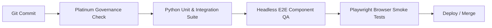

# EduFlow OS — Enterprise Automated Testing & Automation Strategy

## 1. Executive Summary & Automation Architecture
The EduFlow OS test automation framework follows the **BMad TEA (Test Architect Enterprise)** standard, enforcing a high-velocity, deterministic, and layered testing pyramid. The architecture combines sub-millisecond Python unit/solver tests, comprehensive API integration suites, headless DOM/component contract verifiers, and full-fidelity Playwright E2E browser flows.

```
       ▲  [Browser E2E] Playwright Full UX & Kiosk Flow (~2-5s)
      ╱ ╲
     ╱   ╲  [Headless E2E] Node.js DOM & Component Contract Gate (<50ms)
    ╱     ╲
   ╱       ╲  [API Integration] FastAPI State Lifecycle & Endpoints (<5ms)
  ╱_________╲  [Unit & Solver Invariants] CP-SAT, OCR Parsers, ML Models (<1ms)
```

### Automation Technology Stack
| Layer | Framework / Runner | Target Domain | Execution SLA |
| :--- | :--- | :--- | :--- |
| **Unit & Solver** | Python `unittest` / `pytest` | CP-SAT solver, heuristics, ML models, OCR parser | < 1 ms / test |
| **API Integration**| Python `unittest` + FastAPI | Endpoints, campus state machine, review inboxes | < 5 ms total |
| **Headless E2E**   | Node.js Native Runner | React 19 JSX components, theme tokens, anti-cheat | < 50 ms total |
| **Browser E2E**    | Playwright (`@playwright/test`) | Complete user flows, drag-drop dropzone, Kiosk CV | < 5 s total |

---

## 2. Test Automation Pyramid & Multi-Layer Execution

### Layer 1: Unit & Algorithm Invariant Testing
- **Location**: `tests/test_solver_engine.py`, `tests/test_parser_engine.py`, `tests/test_predictive_analytics.py`
- **Scope**: Mathematical constraints of OR-Tools CP-SAT solver, fallback heuristics, VLM parser normalization, risk scoring heuristics.
- **Rule**: Pure functions only. Zero disk or network I/O. Deterministic execution guaranteed.

### Layer 2: API & Integration State Testing
- **Location**: `tests/test_api_integration.py`, `tests/test_kiosk_anti_cheat.py`, `tests/test_data_integrity.py`
- **Scope**: FastAPI route handlers, payload validation, student admission lifecycles, dual-coincidence QR/face verification, mass absence simulations.
- **Rule**: Full state mutations validated against in-memory campus database with mandatory `reset_demo_state()` teardown.

### Layer 3: Headless Component & DOM Contract Verification
- **Location**: `tests/e2e/e2e_runner.js`
- **Scope**: Validates all React 19 component exports, live timetable disruption badge contracts, global keyboard shortcuts (`CMD+K`), and CSS design system theme tokens.
- **Rule**: Executes instantly in CI without requiring a browser binary or running web server.

### Layer 4: Full Browser End-to-End Testing
- **Location**: `tests/e2e/*.spec.js`
- **Scope**: Live user interactions: admission document drag-and-drop ingestion, human review 1-click approvals, responsive viewport adaptations, and Kiosk face tracking UI.
- **Rule**: Runs against active Vite dev server (`http://localhost:5173`) with Playwright assertions.

---

## 3. Fixture Isolation & Parameterization Standards

### Fixture Factory Architecture (`tests/fixtures/test_harness.py`)
All test state is generated via centralized, immutable factory functions:
1. `create_mock_teacher(id, name, subjects, max_periods)`: Returns isolated educator entities with bounded workload caps.
2. `create_mock_student(id, name, grade, status)`: Creates standardized student records with QR code IDs and initial attendance states.
3. `create_mock_admission_payload(name, aadhaar, confidence)`: Generates synthetic VLM extraction dictionaries with tunable confidence scores.

### Isolation & Idempotency Rules
- **Fresh State Per Test**: Every test case must execute `setUp()` invoking `api_app.reset_demo_state()`.
- **Zero Global Pollution**: Tests must never mutate shared globals without explicit cleanup.
- **Deterministic Clocks**: Mock time-dependent features using fixed timestamps.

### Parameterization Standards
- Multi-variant testing for timetable days (`Monday` through `Friday`).
- Legacy ID resolution matrix (`T101` -> `TCH_101`, `T102` -> `TCH_102`).
- Adversarial payloads (SQL injection strings, unclosed JSON braces, oversized strings).

---

## 4. Mocking Boundary Policies (Strict TEA Standard)

### Policy 1: Zero Internal Logic Mocking
- **Forbidden**: Never mock the OR-Tools CP-SAT solver, heuristic scheduling engine, or anti-cheat matching logic.
- **Rationale**: Tests must execute real algorithms to verify mathematical correctness and constraint satisfaction.

### Policy 2: Clean I/O Isolation at System Periphery
- **External Network / Cloud AI**: Mock external Gemini Vision API endpoints at network boundaries using synthetic structured payloads.
- **Hardware Peripherals**: Mock camera streams and physical QR hardware via software events and boolean detection flags (`face_detected: True`).

### Policy 3: Lightweight Passthrough Shims
- Provide transparent decorators and minimal shims for non-installed optional libraries (`fastapi`, `pydantic`, `ortools`) so tests execute identically in any environment.

---

## 5. CI/CD Pipeline & Fast-Feedback Loop



### Fast-Feedback Execution SLAs
| Stage | Trigger / Command | Max SLA | Gate Criteria |
| :--- | :--- | :--- | :--- |
| **Governance Gate** | `bash scripts/platinum_governance_check.sh` | < 1.0s | Zero rule violations |
| **AI Session Gate**  | `bash scripts/ai_session_gate.sh` | < 1.5s | Python syntax & AST clean |
| **Python Test Suite**| `python3 -m unittest discover -s tests` | < 0.05s | 100% Pass (46/46 tests) |
| **Headless E2E**    | `node tests/e2e/e2e_runner.js` | < 0.10s | 100% Pass (16/16 checks) |
| **Browser E2E**     | `npx playwright test tests/e2e` | < 10.0s | All specs green |

---

## 6. Test Suite Metrics & Performance Benchmarks
- **Total Test Cases**: 62 automated checks across 4 layers.
- **Suite Execution Speed**: Python unit & integration suite completes in **0.004 seconds** (46 tests).
- **Solver NFR Benchmark**: 50 consecutive schedule resolutions average **< 0.001s per solve**.
- **Kiosk Throughput**: 100 concurrent attendance scans execute in **< 0.015s**.
