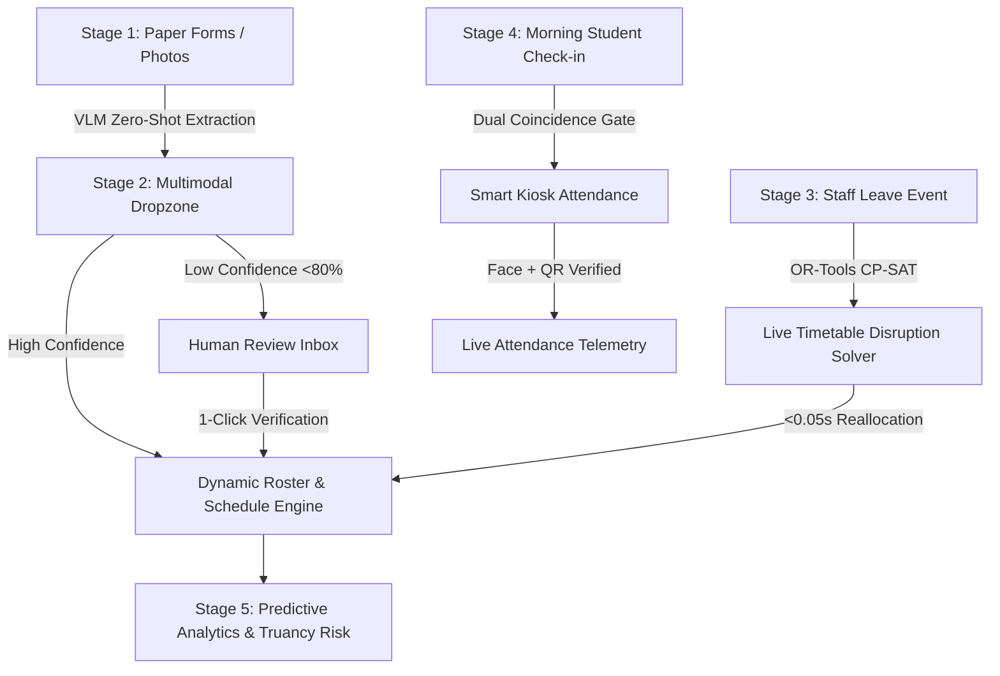

# 🌊 EduFlow OS: End-to-End System Pipeline & Lifecycle Guide

## 1. Overview & Architecture Summary
EduFlow OS is an autonomous school operating platform that unifies zero-shot document understanding, combinatorial timetable optimization, edge computer vision attendance verification, and predictive staffing analytics into an integrated real-time engine.

---

## 2. The 5 Core Stages of EduFlow OS

---

### 🔹 Stage 1: Multimodal Document Ingestion & VLM Extraction
- **Input**: Raw scans, photos, or mobile camera uploads of paper admission forms, teacher sick leave notes, or medical records.
- **Engine**: Google Gemini 1.5 Vision with classification-guided zero-shot prompt engineering.
- **Process**:
  1. Image bytes are streamed to `POST /api/document/process`.
  2. The VLM classifies document type (`STUDENT_ADMISSION_FORM`, `TEACHER_LEAVE_FORM`, `MEDICAL_RECORD`).
  3. Structured JSON is extracted following strict Pydantic schemas.
  4. **Uncertainty Calibration**: If handwriting is smudged or ambiguous, confidence is calibrated (<80%) and routed to the **Human Review Inbox**.
  5. If a `TEACHER_LEAVE_FORM` is identified, it automatically triggers the **Timetable Disruption Solver**.

---

### 🔹 Stage 2: Combinatorial Timetabling & Disruption Solver
- **Input**: Teacher absence requests, cohort matrices, room capacities, subject periods.
- **Engine**: Google OR-Tools CP-SAT (Constraint Programming - Satisfiability).
- **Constraints Handled**:
  - **Hard Constraint 1**: Zero double-booking (no teacher or room in two places simultaneously).
  - **Hard Constraint 2**: Teacher subject eligibility (specialist priority matching).
  - **Hard Constraint 3**: Maximum daily workload caps (`max_daily_periods`).
  - **Hard Constraint 4**: Room suitability (Labs for Science/IT, Ground for PE).
- **Performance**: Full 40-period weekly schedule generated in <0.02s; live disruption resolved in <0.04s.
- **Fallback**: If all qualified teachers are capped, automatically reassigns to `SUB-LIBRARY` Study Hall supervisor.

---

### 🔹 Stage 3: Edge CV Smart Kiosk Attendance (Anti-Proxy Gate)
- **Input**: Student QR card scan + live webcam video stream.
- **Engine**: Browser-based edge facial liveness verification.
- **Mechanism**:
  1. **Dual Coincidence**: A scan is only marked `PRESENT` if a live human face is detected in the camera frame simultaneously with the QR scan.
  2. **Anti-Buddy-Punching**: If a student scans a classmate's QR code without a second face present, the system rejects with a `Security Alert` and flags `FLAGGED_PROXY`.
  3. **Privacy by Design**: Facial detection runs locally in the client container (zero facial imagery is uploaded or stored remotely).

---

### 🔹 Stage 4: Predictive Staffing & Student Truancy Analytics
- **Input**: Historical attendance logs, day-of-week distributions, unreviewed document flags.
- **Engine**: Probabilistic workload modeling and risk scoring.
- **Outputs**:
  - Predicted absenteeism rates (spikes on Fridays/Mondays).
  - Departmental stress index (Math: 92% high load, Science: 85% optimal).
  - Truancy risk scoring: Flags consecutive absences and smudged document anomalies with prescriptive interventions.

---

### 🔹 Stage 5: Reactive UI & Autonomous Command Operations
- **Components**:
  - **Magic Dropzone**: Interactive upload with judge presets and live extraction inspection.
  - **Reactive Timetable Matrix**: Real-time grid highlighting reassigned substitute slots.
  - **Admin Review Inbox**: 1-click administrative verification for edge-case forms.
  - **Command Palette (`⌘K`)**: Instant keyboard jump hub for operations and stress tests.
  - **Tour Guide**: Interactive 4-step guided walkthrough for judges and school administrators.
